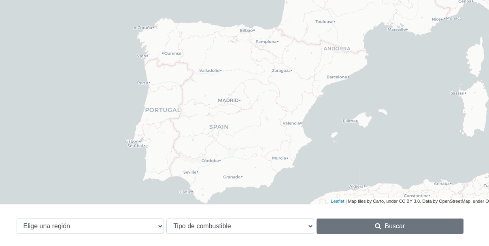
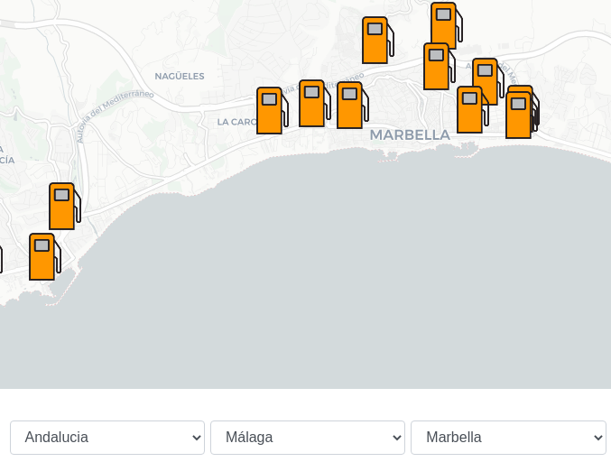

# ironMapp	

## Table of contents
* [Introduction](#introduction)
* [Technical information](#technical-information)
* [Setup](#setup)

## Introduction
ironMapp is a map-based web application centered around petrol stations in Spain. It was made by [Jose Manuel Macías](https://github.com/josmac) and  [Tomás Loroño](https://github.com/TL-Garcia) as a class project at Ironhack

The idea was to create a platform where users could compare the current prices for petrol in different stations based on their location. 

One of the core values for this project was using open/public resources whenever possible (more detail on the APIs later)
Another was not locking users behind a login screen. Thus authentication is encouraged for full functionallity but not required for a basic use of the site.

Check out a live demo [Here!](https://iron-mapp.herokuapp.com/)

## Technical information

### Features
* Search can be narrowed down by region => province => district 

* Search query can include fuel type
* Login through Google / Slack
* Password encryption
* Logged users can make/delete/edit reviews for any station
* Logged users can rate and/or save a station as favourite

### Technologies
* Express web application 
* HBS for HTML 
* MongoDB database through Mongoose
* Bootstrap 4
* Express-session for local authentication
* Passport-js for social login
* Nodemailer for email verification
* Bcrypt for password encryption
* Cloudinary for image upload
* Axios for AJAX calls 

### APIs
* [Geoportal Gasolineras](https://geoportalgasolineras.es/) for obtaining the petrol stations' data & prices  (public API by [Ministerio de la Transición Ecológica](https://energia.gob.es/))
* [Leaflet](https://leafletjs.com/) for everything map-related (based on [Open Street Map](https://www.openstreetmap.org/))

## Setup 
To run this project : 

1.  Fork this repo
2.  Run `npm install` in your project's folder
3.  Create a `.env` file and create enviroment variables based on .env.template (some services will require registration)
4.  Run  `npm start`
